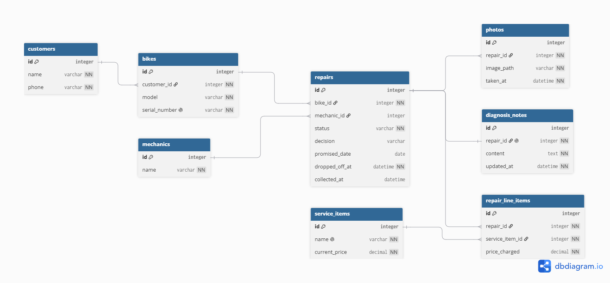

Table customers {
  id integer [pk, increment]
  name varchar [not null]
  phone varchar [not null]
}

Table bikes {
  id integer [pk, increment]
  customer_id integer [not null, ref: > customers.id]
  model varchar [not null]
  serial_number varchar [not null, unique]
}

Table mechanics {
  id integer [pk, increment]
  name varchar [not null]
}

Table repairs {
  id integer [pk, increment]
  bike_id integer [not null]
  mechanic_id integer
  status varchar [not null, default: 'dropped_off']
  decision varchar
  promised_date date
  dropped_off_at datetime [not null]
  collected_at datetime
}

Table photos {
  id integer [pk, increment]
  repair_id integer [not null, ref: > repairs.id]
  image_path varchar [not null]
  taken_at datetime [not null]
}

Table diagnosis_notes {
  id integer [pk, increment]
  repair_id integer [not null, unique, ref: - repairs.id]
  content text [not null]
  updated_at datetime [not null]
}

Table service_items {
  id integer [pk, increment]
  name varchar [not null, unique]
  current_price decimal [not null]
}

Table repair_line_items {
  id integer [pk, increment]
  repair_id integer [not null, ref: > repairs.id]
  service_item_id integer [not null, ref: > service_items.id]
  price_charged decimal [not null]
}

Ref: repairs.bike_id > bikes.id
Ref: repairs.mechanic_id > mechanics.id

## Lifecycle

Allowed states: `dropped_off` → `in_diagnosis` → `awaiting_decision` → `in_progress` → `ready_for_pickup` → `collected`

Simple jobs (e.g. a flat tyre): `dropped_off` → `in_progress` → `ready_for_pickup`

Allowed transitions:
- `dropped_off` → `in_diagnosis` (mechanic starts looking at it)
- `dropped_off` → `in_progress` (simple job)
- `in_diagnosis` → `awaiting_decision` (waiting on customer)
- `awaiting_decision` → `in_progress` (customer approved)
- `awaiting_decision` → `ready_for_pickup` (customer declined, no work done)
- `in_progress` → `ready_for_pickup` (work finished)
- `ready_for_pickup` → `collected`

Disallowed:
- `collected` → anything.
- `ready_for_pickup` → `in_progress`. Once marked ready, it can't silently go back into work without a new repair.
- `dropped_off` → `collected` directly. A bike has to be worked on or declined before collection.
- `awaiting_decision` → `collected`. A pending decision must resolve to approved or declined first.

| Entity | Story it traces to |

| Customer | 7 |
| Bike | 1, 4 |
| Mechanic | 2 |
| Repair | 2, 6, 9a, 9b, 10 |
| Photo | 5 |
| DiagnosisNote | 8 |
| ServiceItem | 3, 11 |
| RepairLineItem | 11, 12 |

## Two decisions to defend

**The thing and the copy of the thing.**

**Derived, or stored?**

