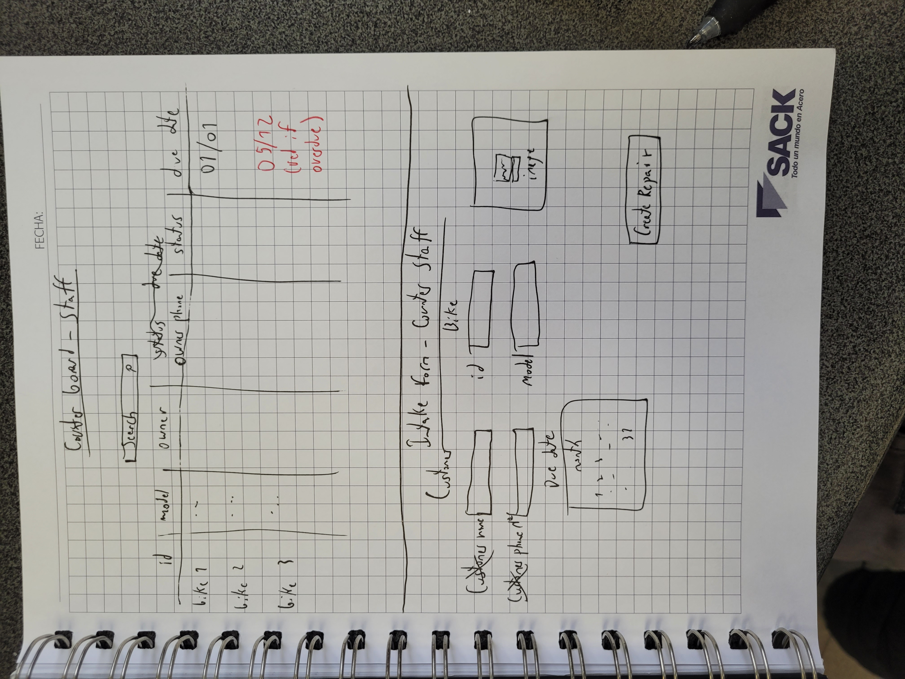
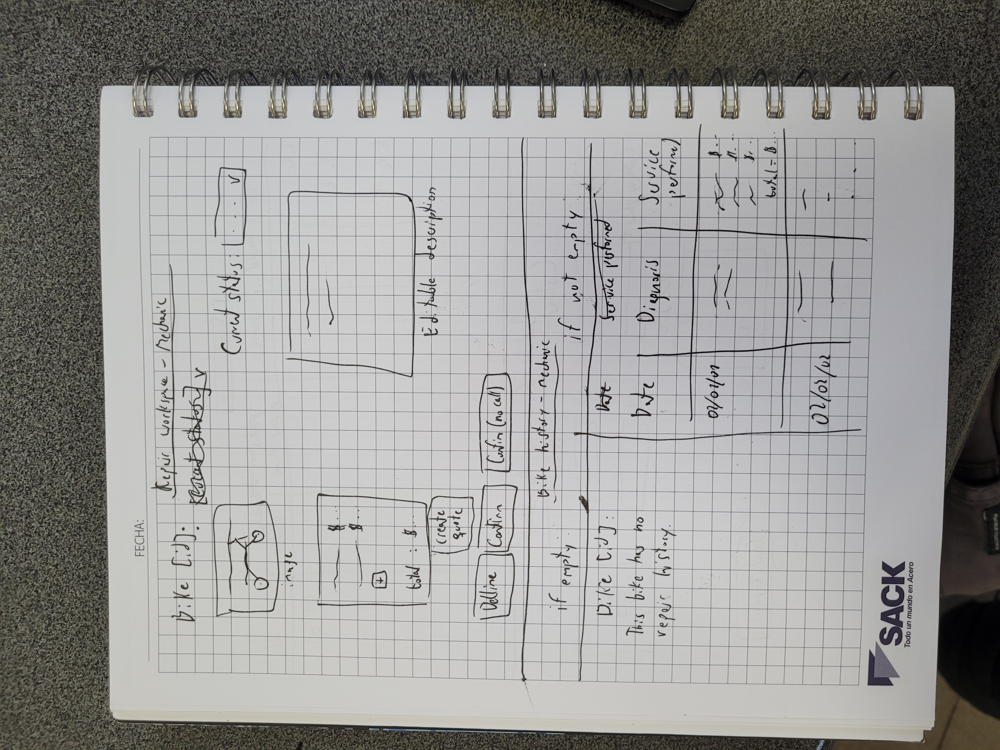
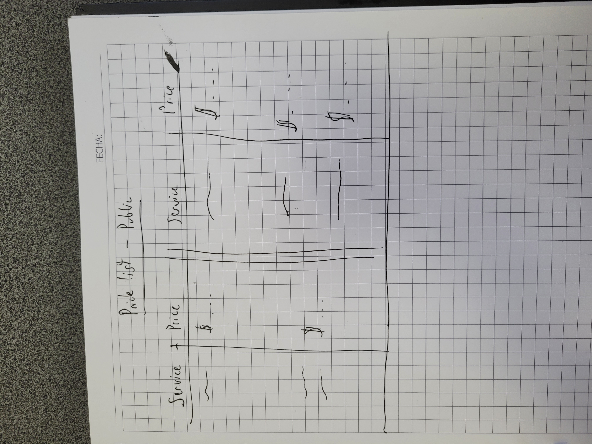
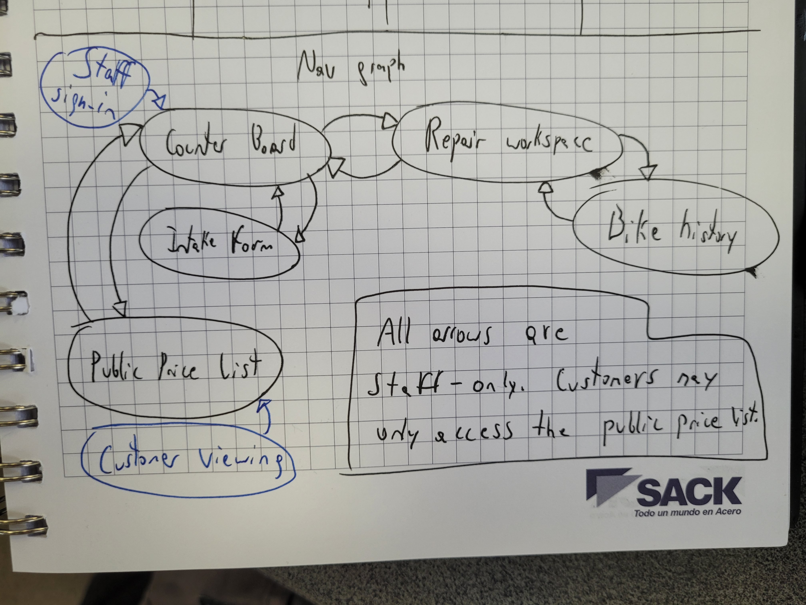

## Screens

**1. Counter board — counter staff**
A list of bikes currently in the shop, each showing customer name, bike, current status, and whether it's overdue against its promised date. Searchable/filterable so a phone call can be answered without walking to the back. This is the "is this bike ready" screen the owner asked for.

**2. Intake form — counter staff**
Used when a bike arrives. Captures customer name and phone, bike model and serial number, promised date, and lets counter staff attach the arrival photo(s). Creates a new repair in `dropped_off` status.

**3. Repair workspace — mechanic**
The working view for a single repair. Shows the diagnosis note (editable), the list of service items added with prices charged (customizable and permanent, so they don't change when the price changes in January and if there's discounts for regulars), the running total, the current status, and controls to record a quote, record the customer's decision (approved/declined), and move the repair through its lifecycle states.

**4. Bike history — mechanic**
Given a specific bike, lists its past repairs in order, each with its date, services performed, and diagnosis note. Shows an explicit "no repair history" message when there are none.

**5. Public price list — customer / public visitor**
A read-only, public page listing every service item and its current price. No login, no repair data, nothing else visible — matches "nothing else public." So users can view prices without having to call or log in or anything.

**Navigation Graph**

